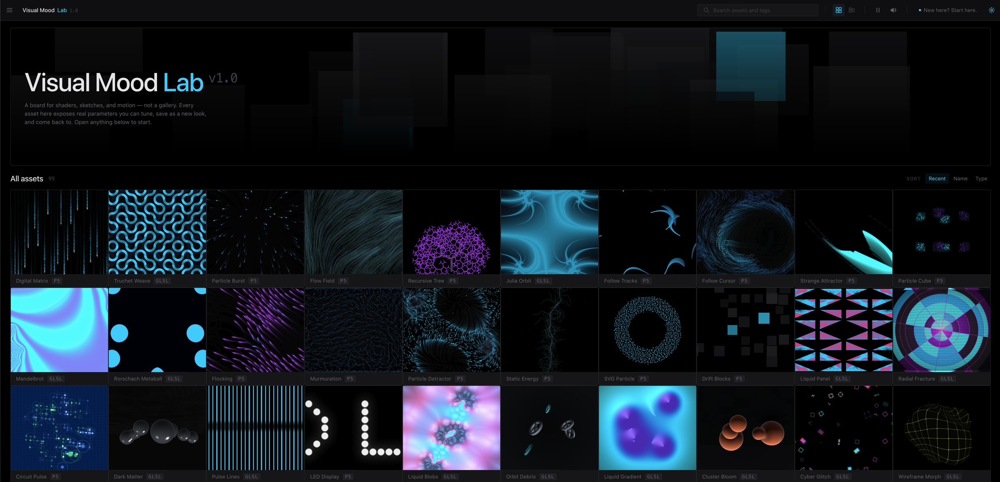
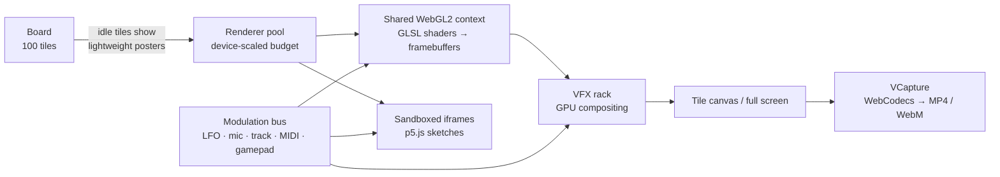

  

<h1 align="center">Visual Mood Lab</h1>

  <strong>A live board for shaders, sketches, and motion — not a gallery.</strong> 
  Every visual is running code with real parameters you can tune, modulate with sound, play from a controller, record, and save as your own look.

  <a href="https://visual-mood-lab.splntr-microtools.com"><strong>Open the app →</strong></a>
  &nbsp;·&nbsp;
  <a href="#features">Features</a>
  &nbsp;·&nbsp;
  <a href="#how-it-works">How it works</a>
  &nbsp;·&nbsp;
  <a href="#devices--browsers">Devices</a>
  &nbsp;·&nbsp;
  <a href="#roadmap">Roadmap</a>

  
  
  
  
  

---

## What it is

Visual Mood Lab is a browser-based creative tool for exploring, shaping, and performing generative visuals. It opens onto a board of **100 animated "mood tiles"** — GPU fragment shaders and p5.js sketches — each one live code rather than a pre-rendered clip.

Open any tile and its parameters are right there: colour, speed, density, distortion, shape, and whatever else that piece exposes. Change them, route them to your microphone or a music track, stack GPU effects on top, map them to a MIDI controller, and save the result as a new look on your board. When it's right, record it straight out of the browser as a video file.

There is nothing to install. It runs on the GPU you already have, in the browser you already use.

## What it's for

| Use case | How Visual Mood Lab fits |
|---|---|
| **Live visuals & VJ sets** | Audio-reactive tiles, a MIDI/gamepad control surface, strobes and mirrors on hand, and window capture straight into OBS or a projector. |
| **Music visualizers** | Load a track onto a tile and let bass, mids, and highs drive its parameters — then record the loop. |
| **Streaming & content backdrops** | Seamless animated loops for streams, reels, lyric videos, and title cards, exported as MP4 or WebM. |
| **Mood boarding & art direction** | Collect, tune, and save visual directions for a project, a brand, or a pitch — with the exact settings kept, not a screenshot. |
| **Motion design reference** | Find a texture or movement quickly, dial it in, and bring the recording into your editor or compositor. |
| **Installations & ambient displays** | Full-screen generative pieces that keep running and keep changing. |
| **Learning creative coding** | Every tile is a working example of a shader or sketch technique, with its controls laid bare. |

---

## Features

### The library — 100 mood tiles
A curated, growing collection spanning fractals, flow fields, particle systems, flocking and murmuration, metaballs, truchet and tiling patterns, strange attractors, glitch, wireframe geometry, liquid gradients, LED displays, and more. Tiles are tagged and searchable, sortable by recency, name, or type, and each is labelled by its renderer (`GLSL` or `P5`).

### The inspector — every parameter, tunable
Controls are generated directly from each tile's code, so what you see is exactly what the piece exposes: sliders, colours, XY pads, toggles, selects, triggers, and file inputs. Save any combination of settings as a new item on your board and come back to it later.

### Modulation — make it move with something
A single modulation system routes signals into any parameter on any tile:

- **LFOs** for steady, rhythmic movement
- **Microphone input** — the room, a mixer feed, or an instrument (analysis only; nothing is recorded or sent anywhere)
- **Uploaded tracks** — per-tile playback with frequency-band analysis and automatic gain, so quiet and loud material both drive the visuals well
- **MIDI controllers and gamepads** — map knobs, faders, and sticks to parameters, and notes or buttons to triggers and toggles, with reusable device profiles and pickup-style takeover so values don't jump

Smoothing and depth are set per route, with sensible defaults chosen for each kind of parameter.

### Tile sound presets — tiles as instruments
Selected tiles carry their own synthesized or sampled sound design, so the visual *plays* as well as reacts: a multi-note rack, envelopes, humanize and swing, and "graze-to-pluck" interaction that turns cursor or touch movement into notes.

### VFX rack — GPU post-processing
Chain up to three effects per tile, composited on the GPU: **Dark Strobe, White Strobe, Linear Mirror, Quad Mirror, Grain, CRT, Noise Displacement, Graphic Slice, Turbulent Feedback, Math Warp**, and more. Effect parameters live on the same modulation system, so a strobe can follow the kick drum.

### VCapture — record straight from the browser
One-button recording of a live tile to **MP4 or WebM**, encoded on your device with WebCodecs — nothing is uploaded to be rendered. Captures are kept alongside the tile they came from.

### Shapeshift — bring your own shape
Tile #100 turns your own text, SVG, PNG, or JPG into an audio-reactive visual: the shape is converted into a distance field on the GPU and filled with motion — strips, columns, shards — that respond to sound.

### A workspace that stays out of the way
- **Floating sidecar panels** (desktop): detach Sound, VFX, VCapture, and Modulate from the side stack and place them wherever suits your screen, or keep them docked as an accordion
- **Focused and full-screen views** for performing and presenting
- **Global pause and master volume** in the header
- **Guided onboarding** — an 8-step walkthrough, shown as a dialog on desktop and a bottom sheet on mobile
- **Respects "reduce motion"** system settings

### Your account, your board
Sign up with email and password. Your board starts with the full library and is yours to tune, save into, and grow. Accounts use modern password hashing (Argon2id), email verification, password reset, session revocation, and rate limiting.

---

## How it works

Visual Mood Lab is built around one idea: **live rendering is a scarce resource, so it's spent deliberately.**

**GPU shaders on one shared WebGL2 context.** Browsers cap how many WebGL contexts a page can hold. Rather than giving every tile its own context, all shader tiles render through a single shared WebGL2 context into offscreen framebuffers, then out to their card. That same pipeline is what makes GPU effect chains — and upcoming tile blending — possible.

**Sketches run in a sandbox.** Every p5.js sketch runs in its own isolated iframe and talks to the app only through messages, watched by a watchdog. A misbehaving sketch can't freeze the board or reach anything it shouldn't.

**Controls come from the code.** Shaders declare their parameters through annotations on their uniforms, and sketches export a parameter list. The inspector is generated from those declarations — no tile has hand-built UI — which is why every tile's controls behave consistently and why every parameter can be modulated or mapped to hardware.

**One signal bus for everything.** Audio analysis, LFOs, MIDI, and gamepad all feed a single modulation bus that targets parameters by name. Controller polling runs on its own isolated loop, so plugging in hardware costs nothing from the rendering budget.

**Built with:** Next.js · React · TypeScript · WebGL2 / GLSL ES 3.0 · p5.js · Web Audio API · Web MIDI & Gamepad APIs · WebCodecs · Postgres · deployed on Vercel.

---

## Performance

Generative visuals are GPU-heavy, and a board of 100 of them would overwhelm any machine if they all ran at once. Visual Mood Lab keeps things smooth by design rather than by hoping:

- **Only what you're looking at runs live.** Idle tiles display lightweight posters; tiles are promoted to live rendering as you engage with them.
- **The live budget adapts to your device.** The number of simultaneously live tiles is set automatically from your hardware — **3** on capable desktops, **2** on machines with four or fewer cores or on touch devices, **1** on low-power touch devices.
- **High-density displays are budgeted.** Retina and high-DPI screens get density limits so heavy shaders don't silently multiply their pixel cost.
- **Recovery is built in.** GPU context loss, backgrounded tabs, and mobile audio interruptions are detected and recovered rather than leaving a blank tile or a silent track.
- **Recording happens on-device.** Hardware-accelerated encoding where your browser supports it, with no server round trip.

---

## Devices & browsers

Visual Mood Lab runs anywhere a modern browser supports **WebGL2** — desktop, laptop, tablet, and phone. No app, plugin, or download.

| Capability | Desktop Chrome / Edge | Desktop Safari | Desktop Firefox | Mobile & tablet |
|---|:---:|:---:|:---:|:---:|
| Browse, tune, and save tiles | ✅ | ✅ | ✅ | ✅ |
| Audio reactivity (mic & tracks) | ✅ | ✅ | ✅ | ✅ |
| GPU VFX rack | ✅ | ✅ | ✅ | ✅ |
| Floating sidecar panels | ✅ | ✅ | ✅ | Docked layout |
| MIDI controllers | ✅ | ⚠️ ¹ | ✅ | ⚠️ ¹ |
| Gamepads | ✅ | ✅ | ✅ | Varies by device |
| VCapture (MP4 / WebM) | ✅ | ⚠️ ² | ⚠️ ² | ⚠️ ² |

¹ Depends on browser support for the Web MIDI API; Safari and iOS browsers do not currently provide it. The app detects this and says so rather than failing silently.
² Recording relies on the browser's WebCodecs support; available formats and reliability vary by browser and version. Chromium-based desktop browsers give the most consistent results.

**For the best experience:** a recent desktop browser with hardware acceleration enabled, and headphones or a line input when working with audio. On phones and tablets, the board automatically runs fewer live tiles at once to keep motion smooth and batteries happy.

**Streaming to OBS:** use Window Capture or Display Capture on the app's full-screen view today. A dedicated clean output link is on the roadmap.

---

## Roadmap

Visual Mood Lab is under active development. Near-term work, roughly in order:

| Status | Feature | What it adds |
|---|---|---|
| 🔜 Next | **Media & Graphic Asset Library** | A dedicated library of SVGs, images, and vector animations to use alongside tiles, starting with a 42-piece custom vector pack. |
| 🧪 Planned | **Playground** | Write a shader or p5 sketch from scratch in the browser, with live reload, inline errors, and controls that appear as you annotate your code. Fork any library tile as a starting point and save your work to the board. |
| 🧪 Planned | **Blend & Mask mode** | Composite two tiles together with blend modes and a modulatable mix amount, and mask a tile through a shape from the media library. |
| 🧪 Planned | **Export & sharing** | High-resolution stills at 1×, 2×, and 4×, frame-exact video export, a command palette, and read-only board sharing links. |
| 🧪 Planned | **Roll & Mutate** | Randomize or gently nudge a tile's parameters to discover new looks in one click. |
| 🧪 Planned | **Touch XY performance pads** | Two-axis touch pads for playing modulation and effects by hand. |
| 🎛️ Ongoing | **More sound presets** | Bringing "tiles as instruments" to more of the library. |
| 🗓️ Later | **Live output** | A clean stage view, pop-out window for a second display, and a direct OBS Browser Source link. |
| 🗓️ Later | **Mobile companion controller** | Use your phone as a wireless control surface for a session running on another screen. |

---

## Privacy

- Microphone input is used **only for live analysis** to drive visuals. It is not recorded, stored, or transmitted.
- Recordings made with VCapture are **encoded on your device**.
- Account passwords are hashed with Argon2id and never stored in plain text.

---

## About

Visual Mood Lab is designed and built by **[SPLNTR Micro Tools](https://splntr-microtools.com)** — small, focused tools for audio-visual work.

- 🌐 [splntr-microtools.com](https://splntr-microtools.com)
- ✉️ [splntraudio@gmail.com](mailto:splntraudio@gmail.com)
- 📷 [@splntr_microtools](https://instagram.com/splntr_microtools)

Feedback, bug reports, and ideas for new tiles are always welcome.

<strong>For developers</strong>

 

Technical setup, architecture notes, verification scripts, and the seed-asset workflow live in **[docs/DEVELOPMENT.md](docs/DEVELOPMENT.md)**.

---

  © 2026 SPLNTR Micro Tools. All rights reserved.

