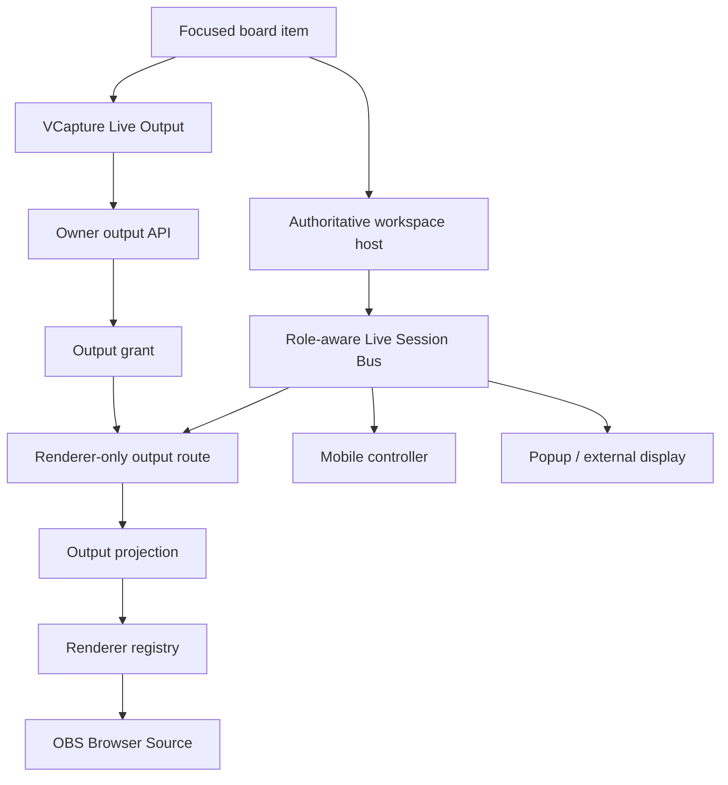

# Visual Mood Lab — Live Output Integration Plan

> **DEFERRED — superseded in sequencing by `VISUAL_MOOD_LAB_FLOATING_PANELS_INTEGRATION_PLAN.md` (rev 3, 2026-09-20).**
> After a source audit of the current build, the next execution phase is **Phase 4.98 — Floating Sidecar Panels (desktop)**, organized in `SPRINT_FLOATING_PANELS.md`. The execution order in §1 below **no longer applies**. Phase 4.98A/4.98B and Phase 6.5 are re-scoped as **6.5A Stage page + pop-out** and **6.5B OBS Browser Source link** (both deferred); the Live Session Bus (4.98B), Mobile Companion Controller (6.25), and native Spout2/Syphon bridge (6.5.6) are parked with re-entry triggers. OBS Window/Display Capture works today. Read this document for the deferred designs, not for scheduling.

**Scope:** Phase 4.98A Clean Output → Phase 4.98B Role-Aware Live Session Bus → Phase 6.25 Mobile Companion Controller → Phase 6.5 Live Output & External Display  
**Prepared:** 2026-09-20 (rev 2)  
**Source baseline reviewed:** `splntrAVdesigns/visual-mood-lab-v1.0` at commit `4fc1677249173b801136862dcf13c00a208484ee`  
**Status:** **DEFERRED (rev 14, 2026-09-20).** Architecture and execution plan complete; application code not changed by this document. Retained as the reference for the contracts, security requirements, and test matrix that deferred Live Output work will need.

---

## 1. Decision and execution order

Build the secure clean-output foundation and role-aware synchronization before Phase 5. Build the mobile-control and wider window/display experience after Phase 5. Keep native GPU sharing optional and additive.

1. **Phase 4.98A — Secure Clean Output Foundation**
2. **Phase 4.98B — Role-Aware Live Session Bus**
3. **Phase 5 — Playground**
4. **Phase 6.25 — Mobile Companion Controller**
5. **Phase 6.5 — Live Output & External Display**
6. **Phase 6.5.6 — Optional Native GPU Output Bridge (Spout2/Syphon)**

This order gives Playground a stable output contract for every future user-authored visual. Phase 4.98B must be a reusable session bus rather than an OBS-only pipe so later controller and display clients do not create parallel realtime systems. Phase 6.25 and 6.5 wait until the renderer/output contract is proven. Touch XY-pad expansion is explicitly parked until the floating sidecar/drawer and floating mood-tile host are complete.

### Delivery boundaries

| Phase | User value | Included | Deferred |
|---|---|---|---|
| 4.98A | Secure visual-only URL for OBS | Grant/token lifecycle, clean output route, selected-card rendering, VCapture setup UI, OBS validation | Cross-process live edits, floating/popup windows |
| 4.98B | Outputs follow workspace changes through a reusable session bus | Client roles, initial state, revisioned deltas, reconnect, revocation, bounded parameter/VFX/playback sync, allowlisted command contract | Mobile controller UI, raw audio buffers, per-frame FFT transport, exact frame mirroring |
| Phase 5 | User-created shaders/sketches inherit output support | Output-compatible asset contract and validation | Window management |
| 6.25 | Phone/tablet becomes a secure companion controller | Explicit pairing, Parameters, Modulate, VFX, Follow Focus/Lock to Tile, reconnect | Touch XY pads until the floating host is shipped; multi-user collaborative editing |
| 6.5 | Flexible performance display modes | Floating sidecar/drawer and mood tile, popup, resize, fullscreen, monitor placement, health/recovery UX; later touch XY-pad enhancement | Native NDI sender unless separately approved |
| 6.5.6 | Optional professional local GPU output | Windows Spout2 sender and macOS Syphon sender through a signed native bridge | Replacement of the browser-source path; browser-native Spout/Syphon |

---

## 2. Verified codebase baseline

The following findings are verified from the reviewed source commit:

- `app/layout.tsx` is minimal and does not force the workspace shell around every route. A clean `/output/[shareId]` route can render without application chrome.
- `features/board/CapturePanel.tsx` is the shared desktop/mobile VCapture settings surface. It is the correct owner for Live Output setup.
- `features/board/RendererStage.tsx` includes board-specific behavior: poster display, hover promotion, error text, automatic poster capture, and playback-store coupling. It must not be reused unchanged for OBS.
- `renderers/registry.ts` and `renderers/types.ts` provide a common shader/p5/media renderer contract.
- `lib/render/pool.ts` owns the shared animation loop, full-quality focused rendering, modulation, effects, audio, and lifecycle cleanup.
- `stores/inspectorStore.ts` already pushes parameter, modulation, sound, and VFX changes into the live pool while persisting durable state separately.
- `board_items` stores `paramsOverride`, `modOverride`, `soundOverride`, and `effectsOverride`. Output must bind to the selected board item, not only to the underlying asset.
- Shader and p5 renderers require executable `asset.source` in the browser. A clean output projection must include the authorized render source.
- Vercel Blob uploads are currently public. The output grant secures the output route; it does not make already-public source media private.
- `proxy.ts` protects `/`, `/board`, `/asset`, and `/playground`; `/output` is currently outside those protected prefixes. Output APIs must enforce their own authorization.
- Upstash rate-limit dependencies already exist and can be extended for output authorization attempts.

### Requires runtime verification

The following items remain unverified until implementation testing:

- OBS Chromium/CEF compatibility with every shader, p5 sketch, media type, font, and VFX combination.
- Exact GPU/color parity between the normal focused view and OBS at matching viewport and quality.
- Transparent-background correctness through every renderer and VFX pass.
- Production behavior and cost of the selected synchronization transport.
- Pointer-dependent, random, feedback, and audio-reactive visuals across independent renderer instances.

---

## 3. Product contract

### Captured output

The output route renders only the selected visual surface. It never mounts:

- The focused-tile header
- GLSL, Code, VFX, Modulate, Sound, VCapture, Record, Snapshot, fullscreen, or close controls
- Navigation, inspector, sidecars, onboarding, tooltips, or workspace error panels

This is enforced by component composition. Controls are absent from the output document rather than hidden with CSS.

### Output identity

An output grant binds to a **board item ID**. That preserves the exact selected card's parameter, modulation, sound, and VFX overrides, including snapshots and user variations of shared library assets.

The underlying asset remains the source of renderer type, executable shader/sketch source, schema, and media URL.

### Independent output versus synchronized output

- **4.98A independent output:** OBS receives the same resolved configuration and runs its own animation clock.
- **4.98B synchronized output:** OBS also receives revisioned workspace changes for parameters, VFX, playback, and approved control state.
- **Exact frame mirror:** not promised. Independent processes can diverge for randomness, feedback history, pointer state, device audio, and timing.

---

## 4. Architecture



### New domain boundary

Create `features/live-output/` as the owner of output-specific UI and client behavior. Server-side grant/projection code belongs under `lib/live-output/`. The normal board feature may open and configure output but must not absorb authorization or transport logic.

### Proposed file map

```text
app/
├─ output/[shareId]/
│  ├─ page.tsx                       # public inert shell, no workspace auth redirect
│  └─ OutputClient.tsx               # fragment token bootstrap + OutputSurface
└─ api/
   ├─ output-links/route.ts          # owner list/create
   ├─ output-links/[grantId]/route.ts# owner revoke
   ├─ output-links/[grantId]/rotate/route.ts
   └─ output/session/route.ts        # bearer validation + initial projection

features/live-output/
├─ LiveOutputSection.tsx             # embedded in CapturePanel
├─ OutputSurface.tsx                 # visual-only renderer host
├─ OutputUnavailable.tsx             # neutral capture-safe fallback
├─ client.ts                         # owner and output API client
├─ output-store.ts                   # output client state/revision handling
└─ types.ts

lib/live-output/
├─ grants.ts                         # creation, hashing, validation, revoke/rotate
├─ projection.ts                     # selected-card resolver and allowlisted DTO
├─ token.ts                          # cryptographic token helpers
├─ policy.ts                         # output runtime policy
├─ transport.ts                      # transport interface
└─ validation.ts

lib/live-session/
├─ session.ts                       # lifecycle, roles, host lease
├─ commands.ts                      # typed allowlisted controller commands
├─ envelopes.ts                     # snapshots, deltas, acknowledgements
├─ transport.ts                     # server-mediated adapter; future WebRTC adapter
└─ validation.ts                    # role and payload validation

features/mobile-controller/
├─ ControllerMode.tsx               # mobile-only performance shell
├─ PairController.tsx               # QR/code/session approval flow
├─ ParametersController.tsx
├─ ModulateController.tsx
└─ VfxController.tsx

lib/db/
├─ schema.ts                         # outputGrants table
└─ migrations/                       # generated migration
```

The final filenames may follow nearby repository conventions discovered during implementation. The ownership boundaries are fixed.

---

## 5. Core data contracts

### OutputGrant

```ts
type OutputGrant = {
  id: string;
  ownerId: string;
  boardItemId: string;
  tokenHash: string;
  status: 'active' | 'revoked';
  preferences: OutputPreferences;
  stateRevision: number;
  expiresAt: Date | null;
  revokedAt: Date | null;
  createdAt: Date;
  updatedAt: Date;
};
```

The owner is verified through the board that owns `boardItemId`. The raw token is returned only on create/rotate and is never stored in plaintext.

### OutputProjection

```ts
type OutputProjection = {
  grantId: string;
  itemId: string;
  assetId: string;
  type: AssetType;
  source?: string;
  srcUrl?: string;
  schema?: ControlSchema;
  params: ParamState;
  mod: ModState;
  effects: EffectInstance[];
  sound: { enabled: false };
  preferences: OutputPreferences;
  revision: number;
};
```

`source` is required for shader/p5 browser rendering. The projection excludes owner identity, board inventory, editor state, unrelated assets, write capabilities, and application controls. The output-token UI must explain that anyone holding the URL can inspect resources delivered to their browser.

### OutputStateEnvelope

```ts
type OutputStateEnvelope = {
  grantId: string;
  revision: number;
  sentAt: number;
  kind: 'snapshot' | 'params' | 'effects' | 'playback' | 'invalidate';
  payload: unknown;
};
```

Receivers accept only increasing revisions, request a fresh snapshot after a gap, and stop immediately on invalidation.

### LiveSession roles and controller commands

```ts
type LiveSessionRole =
  | 'workspace-host'
  | 'output-viewer'
  | 'mobile-controller'
  | 'display-viewer';

type ControlCommand = {
  sessionId: string;
  commandId: string;
  clientId: string;
  sequence: number;
  targetBoardItemId: string;
  kind:
    | 'set-base-param'
    | 'set-modulation'
    | 'set-effect-param'
    | 'toggle-effect'
    | 'performance-action';
  payload: unknown;
  sentAt: number;
};
```

The workspace host remains authoritative. A mobile client sends an allowlisted command, receives an acknowledgement, and then consumes the canonical state revision. It never writes arbitrary store/database state and never talks directly to OBS. Same-account authentication is required but does not auto-pair devices; explicit session selection and desktop approval are required.

### Output runtime policy

```ts
type OutputRuntimePolicy = {
  audio: 'disabled';
  deviceInputs: 'disabled';
  posterWrites: false;
  workspaceShortcuts: false;
  visibleErrors: false;
  maxLiveRenderers: 1;
  quality: 'full';
};
```

The first implementation can use the existing pool inside the isolated output route with a projection that forces sound off. If that creates hidden board coupling during implementation, introduce a pool factory with immutable policy while keeping `getPool()` behavior unchanged for the main app.

---

## 6. Phase 4.98A — Secure Clean Output Foundation

### 4.98A.0 — Contract lock and safety baseline

**Work**

- Freeze the DTOs above and document fields that may cross the token boundary.
- Add tests for resolving canonical cards, snapshots, and user overrides of library assets.
- Confirm `/output/*` remains public at the route boundary while all owner-management APIs require `requireUser()`.
- Add output-specific rate-limit buckets without changing login/reset budgets.

**Exit**

An authorized board item resolves deterministically to one allowlisted projection, while another user's board item returns the same generic not-found response as a missing item.

### 4.98A.1 — Grant model and token lifecycle

**Work**

- Add `output_grants` with indexed owner, board-item, status, and expiry fields.
- Generate at least 32 random bytes using a cryptographically secure generator.
- Store a one-way hash only; compare safely.
- Create, list status, revoke, and rotate owner operations.
- Default expiry to “Until revoked”; support 24 hours and 7 days under Advanced settings.
- Return the raw token once. Later status calls return only a masked fingerprint.

**URL**

```text
https://visual-mood-lab.splntr-microtools.com/output/<shareId>#token=<secret>
```

The fragment avoids sending the secret in the initial HTTP request and referrer. `OutputClient` reads it and submits it in an `Authorization: Bearer` request. If the user loses the secret, they replace the link; the server cannot recover it from the hash.

**Exit**

Create/rotate/revoke pass authorization and tampering tests. Rotation invalidates the old URL.

### 4.98A.2 — Selected-card projection

**Work**

- Join grant → owned board item → asset.
- Resolve override precedence exactly as the board loader does:
  - board-item override when present
  - canonical asset value otherwise
- Force sound disabled for this visual-only phase.
- Include shader/p5 source because client rendering requires it.
- Keep current public media URLs explicit as a known storage characteristic.

**Exit**

The projection matches the selected card's visual configuration, including snapshots and library-derived overrides.

### 4.98A.3 — Renderer-only OutputSurface

**Work**

- Create a dedicated client surface that owns one host element.
- Promote one full-quality renderer through the shared renderer registry/pool lifecycle.
- Apply resolved params and VFX.
- Fill `100vw × 100vh`; use `ResizeObserver`; remove margins and scrolling.
- Render neutral black on authorization, compile, reconnect, or runtime failure. Keep diagnostics in VCapture/preview tooling rather than the captured frame.
- Dispose renderer, VFX relay canvases, animation loops, observers, and subscriptions on unmount.

**Do not use**

- `FocusedAssetOverlay`
- `RendererStage` without extracting its board-only behaviors
- CSS rules that hide mounted controls

**Exit**

DOM inspection confirms that the output document contains the renderer host and capture-safe fallback only.

### 4.98A.4 — VCapture integration

Add a collapsed **Live Output (OBS)** section below recording format/duration.

**Initial state**

- Selected tile name
- “Create a secure visual-only URL for OBS Browser Source”
- `Create secure link`

**Active state**

- Status: Ready / Expired / Revoked
- Masked fingerprint
- `Copy URL`
- `Open Preview`
- Overflow: Replace Link / Revoke

**Advanced**

- Expiry
- Aspect preset: Tile / 16:9 / 1:1 / 4:5 / 9:16 / Custom
- Fit: Contain / Cover
- Background: Black initially; Transparent remains disabled until alpha QA passes

The output stays pinned to the card used at creation. Opening another tile does not silently retarget a live OBS scene.

**Exit**

Desktop and mobile VCapture share the same section and lifecycle states without adding another focused-tile header action.

### 4.98A.5 — OBS validation gate

Test the official OBS Browser Source workflow at:

- 1920×1080 landscape
- 1080×1080 square
- 1080×1350 portrait post
- 1080×1920 vertical
- Custom nonstandard viewport

Coverage must include:

- Shader with and without feedback
- p5 sketch
- Image, SVG, and video
- VFX-enabled shader
- Snapshot/override card
- Reload, scene hide/show, shutdown-when-hidden, revoke, and expired token

**Phase 4.98A exit criterion**

From the focused card, the owner creates and copies a secure link from VCapture, adds it to OBS Browser Source, and receives a continuously animated visual with no controls. The URL survives OBS restart until expiry/revocation, and revoke stops access.

---

## 7. Phase 4.98B — Role-Aware Live Session Bus

### Synchronization scope

Synchronize:

- Parameter changes
- VFX chain changes
- Play/pause and global speed
- Asset replacement only through an explicit owner action
- Revocation/invalidation
- Connected-client role and health state
- Typed command acknowledgements needed by future controller clients

Do not transmit in this phase:

- Raw microphone samples
- Uploaded audio buffers
- Per-frame FFT arrays
- Direct MIDI/gamepad device access
- Encoded video frames

Audio/MIDI-reactive parity can be considered later by relaying bounded resolved parameter values at a controlled rate. It must not stream raw device data. Phase 4.98B does not build the mobile UI, but its transport, envelopes, leases, authorization, and validation must support `mobile-controller` as a future role.

### 4.98B.0 — Transport decision spike

Implement the transport behind this interface:

```ts
interface LiveSessionTransport {
  publish(message: OutputStateEnvelope): Promise<void>;
  subscribe(onMessage: (message: OutputStateEnvelope) => void): () => void;
  requestSnapshot(): Promise<OutputStateEnvelope>;
  close(): void;
}
```

Evaluate with a production preview deployment:

| Option | Strength | Limitation | Decision rule |
|---|---|---|---|
| Vercel WebSockets beta | Same deployment and bidirectional | Connections are instance-bound; cross-instance fan-out still needs shared distribution | Use only if beta acceptance and distribution design pass soak test |
| Managed realtime provider | Built-in channel fan-out/reconnect | New service, credentials, cost, dependency | Preferred when reliable cross-instance sync is the priority |
| Short/long polling | Minimal dependency | Latency and request volume | Fallback for low-frequency control sync only |

`BroadcastChannel` may optimize same-browser preview but cannot serve OBS or cross-device control. The baseline controller transport is the selected server-mediated realtime adapter. WebRTC DataChannel remains a future low-latency local mode behind the same interface, with signaling and relay fallback; it is not required for v1.

**Exit**

One transport is selected with measured reconnect time, event latency, idle behavior, and estimated cost. The rest of the app depends only on `LiveSessionTransport`.

### 4.98B.1 — Publisher integration

**Work**

- Publish after inspector actions update the live pool, using the resolved state already produced by the store.
- Coalesce slider updates to a bounded rate; always flush the final value.
- Increment revisions on the server or through one authoritative publisher lease.
- Persist durable final values through the existing persistence flow; realtime messages remain transient.
- Do not put transport calls inside the renderer's per-frame loop.
- Reserve a command-ingress path that validates role, command kind, target board item, sequence, and payload before applying anything to the workspace host.

**Exit**

Fast slider and VFX changes stay smooth locally, produce bounded traffic, and converge to the final persisted state.

### 4.98B.2 — Receiver and recovery

**Work**

- Authenticate before joining a channel; disconnect unauthenticated sockets quickly.
- Apply only increasing revisions.
- Detect gaps and request a full snapshot.
- Exponential reconnect with jitter and an upper bound.
- Apply updates through renderer/pool methods rather than remounting.
- On revoke/expiry, dispose the renderer and display neutral black immediately.

**Exit**

OBS recovers after network interruption without duplicate animation loops, duplicate subscriptions, state rollback, or a full renderer remount for normal parameter changes.

### 4.98B.3 — Control ownership and status UX

**Work**

- One workspace session is the active publisher for a grant.
- A second workspace receives a clear “Output controlled elsewhere” state and may explicitly take over.
- VCapture shows Connected / Reconnecting / Offline / Revoked.
- The captured output contains no status overlay.
- Model one active workspace host, one mobile controller in the first controller release, and any number of read-only output/display viewers.

**Phase 4.98B exit criterion**

An OBS Browser Source follows approved parameter, VFX, playback, and speed changes with bounded latency, reconnects to the latest revision, and stops immediately when revoked. The same session layer can authorize a future `mobile-controller`, validate typed commands, and return canonical acknowledgements without changing the OBS projection contract.

---

## 8. Phase 5 compatibility gate

Before Playground ships, every saved user-authored shader/sketch must pass the existing renderer contract plus these output checks:

- Produces an `OutputProjection`
- Loads without workspace context
- Uses only output-available resources
- Disposes cleanly
- Does not require editor components
- Reports compile/runtime failure out of band

Playground does not need to know about OBS URLs. It saves normal assets; the renderer/output contracts make them available automatically.

---

## 9. Phase 6.25 — Mobile Companion Controller

Start after Phase 5 compatibility and the 4.98B production soak. This phase turns an authenticated phone or tablet into a focused touch controller without running the full visual renderer by default.

### 6.25.0 — Explicit pairing and session selection

- Desktop creates a short-lived pairing session with QR code and six-character fallback code.
- Mobile user signs into the same account, chooses **Use as Controller**, and selects/scans the intended session.
- Desktop explicitly approves the device. Same Wi-Fi is optional and is not treated as identity or trust.
- Controller capability is short-lived, role-scoped, revocable, and separate from the OBS bearer grant.

### 6.25.1 — Controller shell and tile targeting

- Touch-first mobile shell with connection/latency status, current tile, reconnect, and exit.
- **Follow Focus** rebuilds controls when desktop focus changes.
- **Lock to Tile** keeps control attached to one board item while desktop focus moves elsewhere.
- One writable controller in v1; additional clients remain read-only until contention rules are intentionally designed.

### 6.25.2 — Schema-generated Parameters

- Reuse the control schema rather than creating mobile-only parameter definitions.
- Use large touch targets and local optimistic feedback, followed by canonical acknowledgement.
- Display the live effective/modulated value separately from the editable base value so modulation does not fight the user's finger.

### 6.25.3 — Modulate and VFX controls

- Support source assignment, amount, smoothing, routing enable, effect slots, bypass, wet/dry, and primary effect parameters.
- Coalesce continuous input to a bounded rate and always flush the exact final value on release.
- Keep full shader/p5 rendering off by default; use a poster or low-rate lightweight preview to protect battery, thermals, and input latency.

### 6.25.4 — Reliability and mobile ergonomics

- Progressive Screen Wake Lock, reconnect/backoff, background/foreground recovery, orientation-safe layout, safe areas, and reduced motion.
- Clear stale/offline mode; queued continuous gestures are discarded rather than replayed after a long disconnect.
- Controller cannot create output grants, inspect source code, delete assets, change account settings, or submit arbitrary state patches.

**Deferred enhancement:** touch XY pads for Modulate and the VFX rack are approved conceptually but are not part of the first controller release. Implement them only after Phase 6.5.1 establishes the floating sidecar/drawer and floating mood-tile interaction model, so desktop and mobile performance surfaces share one deliberate control language.

**Phase 6.25 exit criterion**

An explicitly paired phone can control the active or locked mood tile's Parameters, Modulate, and VFX state with bounded latency and reliable final-value convergence. Desktop, mobile, OBS, and other read-only outputs all display the same canonical revision after reconnect.

---

## 10. Phase 6.5 — Live Output & External Display

Start after Phase 5 and after 4.98B has passed production soak testing.

### 6.5.0 — Shared host abstraction

Create an `OutputHost` layer around `OutputSurface` with host capabilities:

```ts
type OutputHostMode = 'embedded-floating' | 'popup' | 'external-url' | 'fullscreen';
```

All modes use the same projection, grant, synchronization, renderer, aspect, fit, and cleanup contracts.

### 6.5.1 — In-app floating tile

**Work**

- Draggable and manually resizable inside the application viewport
- Aspect lock, snap guides, min/max size, reset position
- Keyboard move/resize alternatives
- Bounds recovery after viewport changes
- Remember bounds per device/session
- Fullscreen action from the floating host
- Sidecar/drawer integration that lets the user expose or collapse the floating mood tile without disturbing the board layout

**Exit**

The user can keep workspace controls visible while positioning a responsive output surface without interrupting the renderer.

**Post-6.5.1 parked sprint — Touch XY performance surfaces**

- Add reusable XY pads to Modulate and the VFX rack after the floating sidecar/drawer and floating mood tile are stable.
- Reuse the same normalized XY command contract on desktop and in Mobile Controller Mode.
- Provide axis assignment, reset/center behavior, pickup/takeover semantics, final-value flush, accessible numeric alternatives, and optional parameter pinning.
- Treat this as a control-surface enhancement, not a prerequisite for clean output, core mobile control, or floating-window delivery.

### 6.5.2 — Desktop pop-out window

**Work**

- Open from a direct user gesture to satisfy popup policies.
- Reuse a named same-origin window rather than creating duplicates.
- Request initial dimensions; let the user manually move and resize with OS controls.
- Detect blocked popup and offer the clean URL/manual-open fallback.
- Reconnect to the existing grant/session without creating a new output link.
- Restore safe last-known bounds when supported.

**Exit**

The workspace and output remain visible in separate windows, including on another monitor, with correct cleanup when either window closes.

### 6.5.3 — Fullscreen and display placement

**Work**

- Fullscreen from an explicit user gesture.
- Optional Window Management API feature detection and permission flow.
- Display picker only where supported; manual placement remains the baseline.
- Handle monitor disconnect, resolution change, DPR change, and fullscreen exit.

**Exit**

Supported browsers can place output on a chosen display; all desktop browsers retain manual move/resize behavior.

### 6.5.4 — External-service workflow

**Work**

- Reuse the clean output URL for OBS and compatible browser-source services.
- Add copyable resolution/setup guidance and output health diagnostics in VCapture.
- Treat native NDI as an OBS/native-tool handoff. A browser-native NDI sender requires a separate approved native bridge or licensed SDK scope.

### 6.5.5 — Reliability and accessibility closeout

Test:

- Popup blocked/allowed
- Window close/reopen
- Resize storms
- Multi-monitor/DPR changes
- Browser restore
- Network interruption
- Laptop sleep/wake
- Renderer context loss
- Keyboard/focus behavior
- Reduced motion and mobile fallback

### 6.5.6 — Optional Native GPU Output Bridge (future professional tier)

Keep the secure browser-source URL as the universal baseline. If measured user demand or GPU profiling justifies a native tier, build a signed companion application that consumes the same `OutputProjection` and 4.98B session state, then publishes a local GPU texture as:

- **Spout2 sender on Windows**
- **Syphon sender on macOS**

The bridge must not fork renderer/state semantics, weaken token security, or become required for OBS. It adds high-performance local interchange with compatible VJ applications; it also adds OS-specific installers, signing/notarization, GPU/driver QA, updates, and OBS/plugin compatibility testing. Native NDI remains a separately approved extension.

**Decision gate:** implement only if Browser Source performance is insufficient, duplicated rendering is a measured problem, or users need direct Resolume/TouchDesigner/VDMX-style GPU texture workflows.

**Phase 6.5 exit criterion**

The same secured visual can run as an in-app floating surface, manually resizable desktop popup, fullscreen output, or external browser source without duplicating renderer logic or exposing workspace controls. The optional native bridge, if approved later, consumes the same contracts rather than replacing them.

---

## 11. Security and privacy requirements

- HTTPS only in production.
- Opaque high-entropy token; one-way hash at rest.
- Generic not-found response for missing, unauthorized, expired, and revoked grants.
- Owner authorization for create, list, rotate, revoke, and takeover.
- Output authorization rate limit separate from account authentication limits.
- `Cache-Control: no-store`, `Referrer-Policy: no-referrer`, and `X-Robots-Tag: noindex, nofollow` for output/session responses.
- Strict validation and size limits for output preferences and realtime envelopes.
- No token in server logs, analytics, query strings, error messages, or state persistence.
- No third-party analytics on the output route.
- Explicit user copy: the URL is a bearer credential and anyone with it can view and inspect delivered visual resources until revoked.
- Controller grants require authenticated same-account membership, explicit desktop approval, short expiry, command-role allowlists, immediate revoke, and inactivity timeout; proximity or same Wi-Fi never grants trust.
- Mobile clients send typed commands only. The workspace host validates target, role, sequence, payload, and current session lease before applying changes.

---

## 12. Performance requirements

- One renderer and one animation loop per output page.
- Full quality with the existing framebuffer-pixel safety budget.
- Parameter updates modify the live renderer without remounting.
- Realtime events are coalesced; final values always flush.
- No database write per animation frame or modulation sample.
- No raw frame/video transport for browser-source output.
- Cleanup removes renderer, observers, VFX canvases, timers, sockets, and channel subscriptions.

Target measurements:

| Metric | Initial target |
|---|---|
| Control-to-output latency | ≤150 ms p95 on normal broadband |
| Mobile gesture-to-canonical acknowledgement | ≤150 ms p95 on normal broadband; measure separately on same-Wi-Fi and remote networks |
| Reconnect to current state | ≤3 seconds p95 |
| Duplicate subscriptions after reconnect | 0 |
| Output renderer count | 1 |
| State loss after reconnect | 0 accepted stale revisions |

These targets require runtime verification and may be adjusted after the transport spike.

---

## 13. Test matrix

| Area | Required proof |
|---|---|
| Authorization | Owner create/list/rotate/revoke; cross-owner denial; tampered/expired/revoked secret denial |
| Projection | Canonical card, snapshot, library-derived override, each asset type |
| DOM isolation | No header, buttons, drawers, inspector, onboarding, hidden controls, or workspace shortcuts |
| Rendering | Shader, p5, image, SVG, video, VFX, feedback, font assets |
| Viewports | 16:9, 1:1, 4:5, 9:16, custom, DPR changes |
| Synchronization | Ordered revisions, coalescing, gap recovery, reconnect, takeover, revoke |
| Client roles | Workspace host, output viewer, mobile controller, and display viewer permissions cannot cross role boundaries |
| Mobile controller | QR/code pairing, explicit approval, Follow Focus, Lock to Tile, base-vs-effective values, final-value flush, background/foreground, wake-lock fallback, revoke |
| XY enhancement | Added only after floating-host gate; axis assignment, pickup/reset, disconnect during gesture, accessible numeric alternative |
| Lifecycle | OBS reload, scene hide/show, shutdown-when-hidden, sleep/wake, network loss |
| Cleanup | No duplicate rAF, sockets, subscriptions, observers, GL/VFX resources |
| Production | Vercel preview and custom domain, real OBS Browser Source |

---

## 14. Migration and rollback

### Migration

- Add `output_grants` through the existing Drizzle migration workflow.
- Deploy database migration before UI activation.
- Keep Live Output behind one feature flag until production OBS verification passes.

### Rollback

- Disable the Live Output UI flag.
- Revoke active grants in one bounded owner/admin operation.
- Leave the additive table in place during rollback; do not drop it as part of emergency recovery.
- Existing VCapture recording remains independent and available.
- Mobile Controller and Native Bridge remain separately feature-flagged so either can be disabled without affecting clean OBS output.

---

## 15. Final delivery gates

### 4.98A complete when

- Secure grant lifecycle works.
- Clean output renders the selected card in real OBS.
- No workspace controls exist in the output DOM.
- Reload, expiry, rotation, and revoke behave correctly.
- Existing VCapture recording passes regression checks.

### 4.98B complete when

- Approved live changes synchronize with measured bounded latency.
- Reconnect restores the latest revision without remount loops.
- Revocation invalidates an active output.
- Transport behavior and cost pass production soak testing.
- Client roles, command validation, and acknowledgements are stable enough to add a mobile controller without changing the output projection.

### 6.25 complete when

- Same-account devices pair only through explicit session selection and desktop approval.
- Parameters, Modulate, and VFX commands converge to the desktop's canonical state after normal use and reconnect.
- Follow Focus and Lock to Tile are predictable, revocation is immediate, and the mobile client cannot exceed its role.
- Full rendering remains optional on mobile and controller thermals/battery/input latency pass measured tests.

### 6.5 complete when

- Floating, popup, fullscreen, and external URL hosts share one renderer/output contract.
- Manual resize and multi-display workflows recover safely.
- Browser limitations are feature-detected and surfaced clearly.
- Performance and cleanup gates pass across supported desktop browsers.
- Touch XY-pad work remains gated behind the completed floating sidecar/drawer and floating mood-tile interaction model.

### 6.5.6 may begin only when

- Browser Source limitations or professional GPU-sharing demand are demonstrated with measurements or validated user workflows.
- The native bridge can reuse `OutputProjection`, Live Session authorization, and canonical state without creating a second renderer contract.
- Windows Spout2 and macOS Syphon packaging, signing, updates, compatibility, and support ownership are explicitly funded and scoped.
